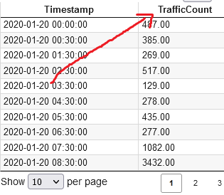
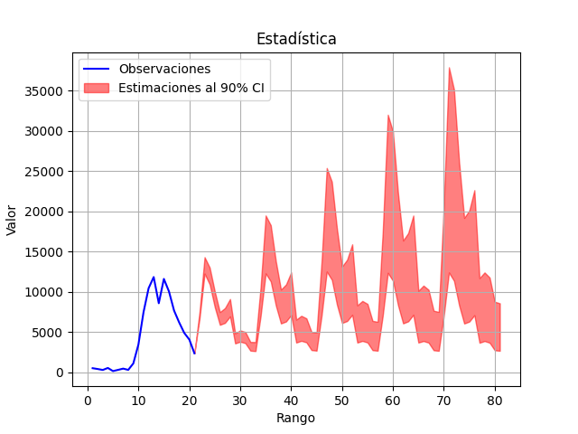
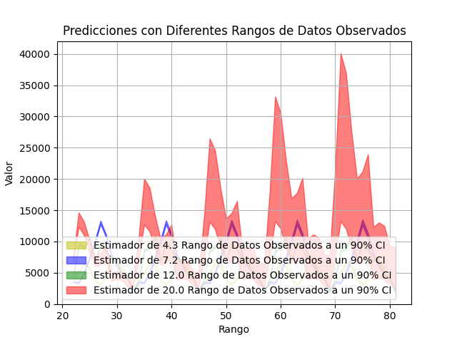
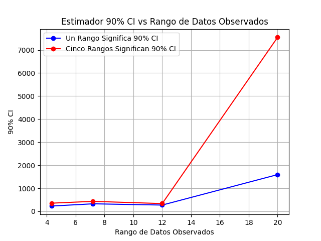

# Arima Time Predictor (ATP)
Modelo de Promedio Móvil Integrado Autoregresivo. Es una técnica estadística utilizada para predecir valores futuros de una serie de tiempo. Es un modelo muy popular en el aprendizaje automático (ML) y se puede implementar en PyTorch.


## ARIMA tiene tres componentes:

* **AR (Autoregresivo):** Utiliza valores pasados de la serie de tiempo para predecir valores futuros. 

* **I (Integrado):** Remueve la tendencia de la serie de tiempo mediante diferencias.

* **MA (Promedio Móvil):** Utiliza valores pasados del error de la predicción para mejorar la predicción.


## Versión 1.0

## Crear un entorno virtual (Opcional)

```bash
python3 -m venv env
source env/bin/active
```


## Instalar dependencias necesarias

```bash
pip install ArimaTP
```


## Archivo CSV

Los archivos CSV (Comma Separated Values) son archivos de texto plano que almacenan datos en forma de tabla. Cada fila representa un registro y cada columna representa un campo, y los valores están separados por comas. 

Aqui le dejo un ejemplo de un [archivo csv](datos.csv) que recoge los datos del tráfico de internet

## Ejecución

```python
import ArimaTP

file_csv = ""
name_columna = ""
ArimaTP.run(file_csv,name_columna)
```

* Recuerda sustituir **file_csv** por el nombre de tu archivo csv y **name_table** por el nombre de la columna que contiene los valores de interés





En mi caso mi archivo csv se llama [datos.csv](datos.csv) y mi columna de valores se llama **TrafficCount** por lo que mi código quedaría estructurado así:


```python
import ArimaTP

file_csv = "datos.csv"
name_columna = "TrafficCount"
ArimaTP.run(file_csv,name_columna)
```


## Output

En la salida se obtendrán las fotos de los gráficos de predicciones











## Parámetros adicionales

* **Puedes modificar la cantidad de predicciones que se realizan pasando como argumento:** num_predictions

* **Por defecto se establece en 60**


```python
import ArimaTP

file_csv = "datos.csv"
name_columna = "TrafficCount"
#Establece la cantidad de predicciones a 15
ArimaTP.run(file_csv,name_columna,num_predictions=15)
```


## ¿ Cuándo usar ArimaTP como solución para proyectos ?

**Se usaría para proyectos que requieran:**

1. Predecir el precio de las acciones de una empresa.

2. Predecir el rendimiento de un fondo mutuo.

3. Estimar la volatilidad de un activo financiero.

4. Predecir la tasa de interés de los bonos.

5. Pronosticar el índice del mercado de valores (por ejemplo, S&P 500, Dow Jones).

6. Analizar el riesgo de crédito de una empresa.


7. Pronosticar la rentabilidad de una inversión.

8. Modelar las tasas de cambio de divisas.

9. Predecir el rendimiento de una cartera de inversión.

10. Analizar los patrones de gasto de los consumidores.

11. Pronosticar el valor de una propiedad inmobiliaria.

12. Estimar el riesgo de fraude financiero.

13. Identificar tendencias de inversión.

14. Predecir las ganancias de una empresa.

15. Modelar el comportamiento del mercado de valores.


16. Pronosticar la demanda de un producto.

17. Predecir las ventas de un artículo en particular.

18. Estimar los niveles de inventario.

19. Optimizar las estrategias de marketing.

20. Ajustar el precio de los productos.

21. Modelar el comportamiento de compra de los clientes.

22. Predecir el volumen de ventas.

23.  Pronosticar la tasa de conversión de ventas.

24. Identificar patrones de compra estacionales.

25. Optimizar los procesos de logística.

26. Predecir la demanda de servicios.

27.  Analizar las tendencias de consumo.

28.  Pronosticar la tasa de crecimiento del mercado.

29.  Estimar la cuota de mercado.

30.  Optimizar la gestión de la cadena de suministro.

31. Predecir el número de casos de una enfermedad.

32. Monitorizar la propagación de una epidemia.

33.  Pronosticar la demanda de atención médica.

34.  Analizar las tendencias de mortalidad.

35.  Predecir la duración de una hospitalización.

36.  Estimar el riesgo de infección.

37.  Monitorizar los resultados de un tratamiento médico.

38.  Pronosticar la necesidad de recursos médicos.

39.  Predecir la tasa de mortalidad infantil.

40.  Analizar los patrones de uso de medicamentos.

41. Pronosticar los niveles de contaminación del aire.

42. Predecir el impacto del cambio climático.

43.  Modelar las tendencias de la temperatura.

44.  Predecir la cantidad de lluvia.

45.  Analizar el nivel del mar.

46.  Pronosticar la frecuencia de incendios forestales.

47.  Evaluar el impacto de la deforestación.

48.  Modelar el crecimiento de las poblaciones de animales.

49.  Predecir la disponibilidad de recursos hídricos.

50.  Analizar la calidad del agua.

51. Pronosticar la demanda de transporte público.

52. Predecir los niveles de tráfico en las carreteras.

53.  Optimizar las rutas de transporte.

54.  Planificar la construcción de nuevas infraestructuras.

55.  Gestionar los tiempos de espera en los aeropuertos.

56.  Analizar los patrones de movilidad.

57.  Predecir los accidentes de tráfico.

58.  Optimizar la gestión del flujo de tráfico.

59.  Pronosticar la demanda de transporte de mercancías.

60.  Evaluar la eficiencia de los sistemas de transporte.

61. Predecir la demanda de energía eléctrica.

62. Pronosticar los precios de la energía.

63.  Optimizar la producción de energía.

64.  Gestionar las reservas de energía.

65.  Analizar el consumo energético.

66.  Modelar la producción de energía renovable.

67.  Pronosticar el impacto de los cambios climáticos en la producción de 
energía.

68.  Evaluar el rendimiento de las plantas de energía.

69.  Optimizar la distribución de la energía.

70.  Analizar el impacto económico de las fluctuaciones de los precios de la energía.

71. Predecir la rotación de personal.

72. Pronosticar la demanda de trabajadores cualificados.

73.  Analizar la satisfacción de los empleados.

74.  Evaluar la eficacia de los programas de formación.

75.  Predecir las necesidades de reclutamiento.

76.  Optimizar la gestión del talento.

77.  Analizar las tendencias del mercado laboral.

78.  Pronosticar el impacto de la automatización en el mercado laboral.

79.  Evaluar la eficiencia de los procesos de selección de personal.

80.  Modelar la gestión del rendimiento de los empleados.

81. Pronosticar el número de turistas.

82.  Predecir la demanda de alojamiento.

83.  Analizar las tendencias de viaje.

84.  Optimizar las estrategias de marketing turístico.

85.  Gestionar los recursos turísticos.

86.  Evaluar el impacto económico del turismo.

87.  Predecir el impacto de eventos en la demanda turística.

88.  Analizar las preferencias de los turistas.

89.  Modelar el impacto del clima en la demanda turística.

90.  Optimizar la gestión de destinos turísticos.

91. Predecir la tasa de crecimiento de la población.

92. Pronosticar las ventas de libros.

93.  Analizar las tendencias de las redes sociales.

94.  Predecir el impacto de la publicidad en las ventas.

95.  Modelar el comportamiento de los usuarios en Internet.

96.  Analizar las tendencias de la tecnología.

97.  Pronosticar el impacto de la innovación en la economía.

98.  Evaluar el riesgo de desastres naturales.

99.  Predecir la demanda de servicios financieros.

100.  Analizar el impacto de la política económica en el crecimiento económico.


## Información para Desarrolladores (DEV)

* [Aquí pueden ver el código fuente con que fue creado la librería ArimaTP](resources/main.py)